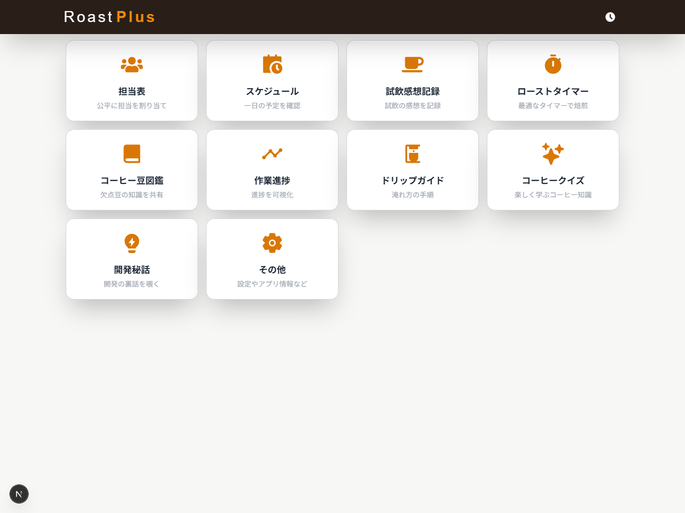
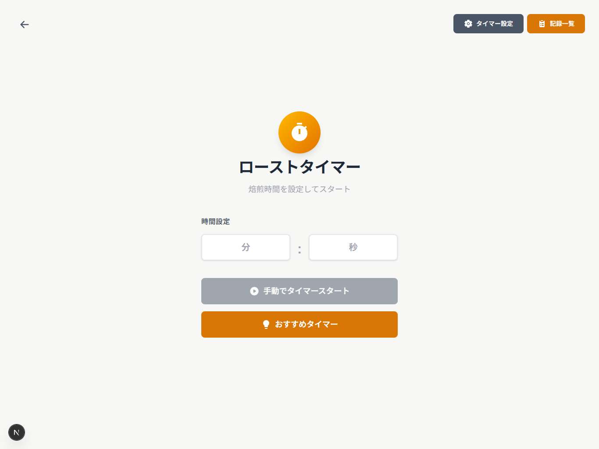
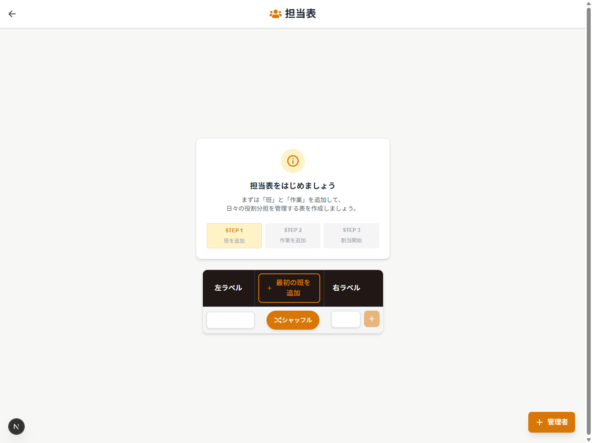
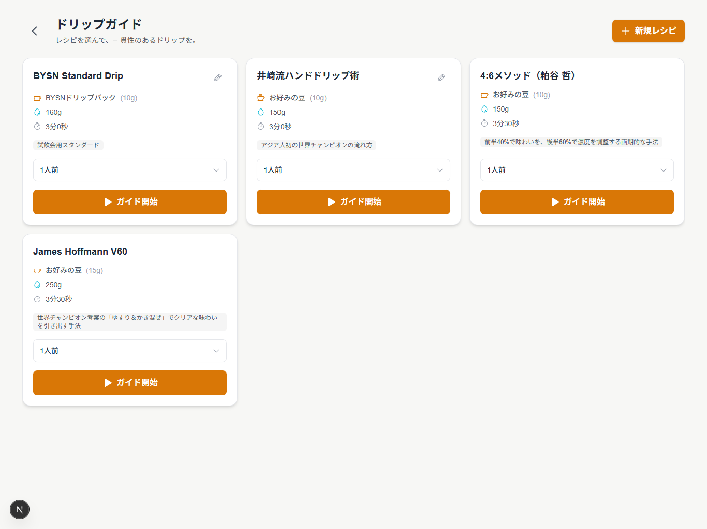

# Roast Plus

**コーヒー焙煎チームのための業務支援PWA**

> 8名のチームで毎日使われている、現場発の業務効率化ツール

<p>
  
  
  
  
  
  
</p>

---

## Screenshots

| ホーム | ローストタイマー |
|:---:|:---:|
|  |  |

| 担当表 | ドリップガイド |
|:---:|:---:|
|  |  |

---

## 概要

**Roast Plus** は、コーヒー豆加工業務（焙煎・ハンドピック・ドリップ等）を行う現場向けに開発した**業務効率化・作業支援Webアプリケーション**です。

実際に私が働いている現場において、**8名のチームで継続的に利用**されており、日々の作業分担や進行管理、作業時間の把握を支援しています。

本プロジェクトは「現場の課題を理解し、使われること」を最優先に設計・開発しました。

---

## 開発背景

現場では以下のような課題がありました。

- 作業担当の割り当てが属人的で、不公平感が生じやすい
- 焙煎・ハンドピックなどの作業時間を正確に記録できていない
- 作業手順や知識が口頭・紙ベースで属人化している
- iPadで直感的に使えるツールが存在しない

これらを解決するため、**現場の業務フローを整理し、ITで支援するツール**としてRoast Plusを開発しました。

---

## 主な機能

### 担当表自動作成
- メンバーの出欠状況を考慮した担当割り当て
- 過去の履歴を考慮し、同じ担当が偏らないシャッフルロジック
- 日々の担当決定を自動化し、準備時間を削減

### ローストタイマー
- 焙煎時間をワンタップで計測・記録
- おすすめタイマー（豆の種類に応じた推奨時間）
- 焙煎記録の一覧・履歴管理

### 試飲感想記録
- セッション単位で試飲の感想を記録
- チームメンバー全員の感想を集約・比較
- AI分析による味わいの傾向レポート

### ドリップガイド
- 複数のドリップレシピ（4:6メソッド、James Hoffmann V60 等）
- 人数に応じた分量自動計算
- ステップバイステップのガイド表示

### コーヒー豆図鑑
- 欠点豆の情報を写真付きで共有
- 新しいメンバーでも迷わず選別作業ができる

### コーヒークイズ
- コーヒーの知識をクイズ形式で学習
- 間隔反復学習（FSRS）アルゴリズムで効率的に記憶定着

### PWA対応
- iPadのホーム画面に追加してネイティブアプリ感覚で利用
- オフライン対応（Service Worker）

---

## セットアップ

### 前提条件

- Node.js 18 以上
- npm
- Firebase プロジェクト（Authentication + Firestore）

### インストール

```bash
# リポジトリをクローン
git clone https://github.com/IKcoding-jp/roastplus.git
cd roastplus

# 依存関係をインストール
npm install

# 環境変数を設定
cp .env.example .env.local
# .env.local を編集して各サービスのキーを設定

# 開発サーバーを起動
npm run dev
```

ブラウザで http://localhost:3000 を開いてください。

### 利用可能なコマンド

```bash
npm run dev      # 開発サーバー起動
npm run build    # プロダクションビルド
npm run lint     # ESLint実行
npm run test     # テスト実行（Vitest）
```

---

## 技術スタック

| カテゴリ | 技術 |
|---------|------|
| **フレームワーク** | Next.js 16 (App Router) |
| **UI** | React 19, Tailwind CSS v4, Framer Motion |
| **言語** | TypeScript 5 |
| **認証・DB** | Firebase Authentication, Firestore |
| **ストレージ** | Firebase Storage |
| **AI** | Google Gemini API（試飲分析） |
| **テスト** | Vitest |
| **PWA** | Service Worker, Web App Manifest |

---

## 実運用について

- **利用者**: 現場メンバー 8名
- **利用状況**: 日常業務で継続利用中
- **フィードバック**: 現場メンバーからの要望を受け、UIや機能を改善

「実際に使われること」を前提に、**機能追加よりも操作の分かりやすさ・迷わなさ**を重視して改善を重ねています。

---

## 工夫した点・学んだこと

- 実際の業務フローを理解しないと、ツールは使われないと学んだ
- 機能を増やすより、現場で迷わないUIを優先する重要性
- フィードバックを受けて、不要な機能を削除・簡略化した経験
- AIをペアプログラマーとして活用しつつ、設計・取捨選択は自分で行った

---

## 今後の改善予定

- 作業データの蓄積・分析機能
- 設定項目の簡略化
- 他現場でも利用できるような汎用化

---

## 開発者について

現場で働く中で感じた「不便」を起点に、**実際に使われるツールを自分の手で作り、改善し続ける**ことを大切にしています。

本プロジェクトは、業務理解・要件定義・設計・実装・運用までを一貫して個人で担当しました。
