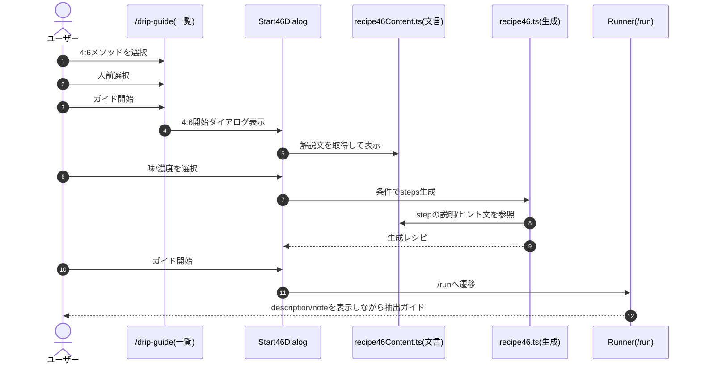

# 4:6メソッド（粕谷）コンテンツ改善要件

## 概要

「4:6メソッド（粕谷）」の説明文・ヒント文を、PHILOCOFFEA側の要点（特に「ほとんど落ち切ってから次を注ぐ」）を反映して改善する。開始前と抽出中の両方に自然に出すことで、ユーザーの「タイマー通りにやらなきゃ…で焦って失敗する」という無意識の不満を解消する。

**重要方針：「タイマーは目安/落ち切り優先」を目立つ場所に置く**

---

## 1. 現状：どこに文言があるか

### Runnerで表示される場所

- `DripGuideRunner.tsx` で `currentStep.description` が本文、`currentStep.note` が電球ヒント枠に出る（＝文言の主戦場）

### 4:6の各ステップ文言の生成元

- `lib/drip-guide/recipe46.ts` の `steps.push({ title, description, note })` がそのままRunnerに流れる

### 開始前ダイアログの案内文

- `components/drip-guide/Start46Dialog.tsx`（味/濃度選択UIの上や下に説明ブロックを置くのが最適）

> つまり「サイトの説明をアプリ内に反映」は **(A) Start46Dialogに"解説"** と **(B) recipe46.tsの各Stepのdescription/note** の2点を厚くすればOKです。

---

## 2. PHILOCOFFEA側の"反映すべき要点"

※PHILOCOFFEA公式ページ（[https://philocoffea.com/?mode=f3][philocoffea-official]）から取得した情報を基に、アプリに入れるべき「不変の要点」を確定しています。

アプリに入れるべきコアはこれです（PHILOCOFFEA公式ページに基づく）：

### 基本原則

1. **40%と60%に分けて、味と濃度を調整する**
   - 総湯量を「味の40%」と「濃度の60%」に分ける
   - 味の40%：最初の2回の注湯で、味わい（甘さ／明るさ）の方向性を決める
   - 濃度の60%：残りの3回の注湯で、濃度を調整する（投数が多いほど濃くなる）

2. **粉量×15の湯量（例：20g→300g）**
   - 基本は「粉量×15」の湯量
   - 1回あたり粉量×3の湯を、合計5回に分けて注ぐ考え方

3. **注ぐタイミングは「注いだお湯がほとんど落ち切ってから次を注ぐ」**
   - これが粗挽きでも濃く抽出できるコツ
   - **重要：表示時刻は目安であり、落ち切りを優先する**

### 準備条件（初回の失敗を減らすために重要）

4. **水は浄水・軟水（硬度50以下、30〜50目安）**
   - 水道水を使う場合は、浄水器を通すか軟水を使用

5. **湯温は沸かしたてを避け、以下の目安**
   - 浅煎り：93℃
   - 中煎り：88℃
   - 深煎り：83℃
   - 沸かしたての湯は避ける（少し冷ましてから使用）

6. **挽き目は粗挽きが基本**
   - 濃くしたければ少し細く、薄くしたければ少し粗く調整

### タイムライン（目安）

7. **標準的なタイムライン（粉量20gの場合）**
   - 0:00 - 60g注湯（蒸らし・味の40%の1回目）
   - 0:45 - 60g注湯（味の40%の2回目）
   - 1:30 - 60g注湯（濃度の60%の1回目）
   - 2:10 - 60g注湯（濃度の60%の2回目）
   - 2:40 - 60g注湯（濃度の60%の3回目）
   - 3:30 - ドリッパーを外す

> **注意**：上記のタイムラインは目安です。**「前の湯がほとんど落ち切ってから次を注ぐ」を最優先**にしてください。

---

## 3. 実装方針：文言を「1ファイルに集約」して差し替えを安全にする

いま `recipe46.ts` にベタ書きされている `description/note` を、**専用のテキスト定義ファイル**に切り出すのが一番事故が少ないです。

### 追加ファイル案

- `lib/drip-guide/recipe46Content.ts`
  - `RECIPE46_DESCRIPTION`（開始前にも使える長めの説明）
  - `RECIPE46_COMMON_NOTE`（全ステップ共通のヒント：落ち切り優先）
  - `RECIPE46_STEP_TEXT`（蒸らし/味/濃度の各説明テンプレ）

#### 例：recipe46Content.ts（そのまま使える叩き台）

```ts
// lib/drip-guide/recipe46Content.ts

export const RECIPE46_TITLE = '4:6メソッド（粕谷）';

export const RECIPE46_DESCRIPTION = [
  '4:6メソッドは、総湯量を「味の40%」と「濃度の60%」に分け、注ぐ量（数字）で味を調整する抽出方法です。',
  '基本は「粉量×15」の湯量（例：20g→300g）。1回あたり粉量×3の湯を、合計5回に分けて注ぐ考え方です。',
  '',
  '【重要】次を注ぐタイミングは「前に注いだお湯がほとんど落ち切ってから」。',
  '表示時刻は目安です。落ち切りを優先してください。',
  '',
  '【準備条件】',
  '・水：浄水・軟水（硬度30〜50目安）',
  '・湯温：浅煎り93℃／中煎り88℃／深煎り83℃（沸かしたては避ける）',
  '・挽き目：粗挽きが基本。濃くしたければ少し細く、薄くしたければ少し粗く調整',
].join('\n');

export const RECIPE46_COMMON_NOTE =
  '次を注ぐタイミングは「前の湯がほとんど落ち切ってから」。時刻は目安です。';

export const RECIPE46_STEP_TEXT = {
  bloom: {
    description:
      '粉全体にまんべんなく注いで、均一に湿らせます（ここから味の40%）。',
    note:
      '粉全体が均一に膨らむか確認。次は「ほとんど落ち切り」を待ってから。',
  },
  taste2: {
    description:
      '味わい（甘さ／明るさ）の方向性を決める注湯です（味の40%）。',
  },
  strength: {
    description:
      '濃度を調整する注湯です（濃度の60%）。投数が多いほど濃くなります。',
  },
} as const;
```

> 上の内容は PHILOCOFFEA由来の要点（40/60、×15、落ち切り優先、水/湯温/挽き目）を、**著作権的に安全な"言い換え"**でまとめています。根拠は前章の複数ソースです。 ([フィロコフィア][1])

---

## 4. どのファイルのどこを直すか（ピンポイント）

### (1) `lib/drip-guide/recipe46.ts`：Step文言を差し替え + 全stepに共通noteを付与

狙いは2つです：

- **"落ち切り優先"を毎ステップで見せる**（抽出中に迷わない）
- 説明は短く、開始前に長文、抽出中は要点だけ（読みながら注ぐのはキツいので）

#### 差分イメージ

```ts
// lib/drip-guide/recipe46.ts
import {
  RECIPE46_COMMON_NOTE,
  RECIPE46_STEP_TEXT,
  RECIPE46_DESCRIPTION,
  RECIPE46_TITLE,
} from './recipe46Content';

// どこかでDripRecipeを組み立てているなら description を RECIPE46_DESCRIPTION に
const recipe: DripRecipe = {
  id: 'recipe-046',
  name: RECIPE46_TITLE,
  description: RECIPE46_DESCRIPTION,
  // ...
};

// 1投目
steps.push({
  id: 'step-1',
  startTimeSec: startTimes[0],
  title: '蒸らし（味：40%）',
  description: RECIPE46_STEP_TEXT.bloom.description,
  targetTotalWater: cumulativeWater,
  note: RECIPE46_STEP_TEXT.bloom.note ?? RECIPE46_COMMON_NOTE,
});

// 2投目
steps.push({
  id: 'step-2',
  startTimeSec: startTimes[1],
  title: '2投目（味：40%）',
  description: RECIPE46_STEP_TEXT.taste2.description,
  targetTotalWater: cumulativeWater,
  note: RECIPE46_COMMON_NOTE,
});

// 3投目以降
steps.push({
  // ...
  description: RECIPE46_STEP_TEXT.strength.description,
  targetTotalWater: cumulativeWater,
  note: RECIPE46_COMMON_NOTE,
});
```

### (2) `components/drip-guide/Start46Dialog.tsx`：開始前に"解説"を入れる（長文はここ）

開始前に読ませたいのは：

- 40/60の意味
- ×15の基本
- **落ち切り優先（タイマーは目安）**
- 水/湯温/挽き目（初回の失敗を減らす）

#### UI追加の最小案（アコーディオン/折りたたみ）

```tsx
// Start46Dialog.tsx
import { RECIPE46_DESCRIPTION } from '@/lib/drip-guide/recipe46Content';

<details className="rounded-lg bg-amber-50 border border-amber-100 p-3">
  <summary className="cursor-pointer text-sm font-semibold text-amber-800">
    4:6メソッドのポイント（必読）
  </summary>
  <pre className="mt-2 whitespace-pre-wrap text-xs leading-relaxed text-amber-900">
    {RECIPE46_DESCRIPTION}
  </pre>
</details>
```

> `pre`にしているのは、改行を保って**読みやすくするため**です（長文を無理に詰めると逆に読まれません）。

### (3) 任意（強くおすすめ）`DripGuideRunner.tsx`：小さい「ポイント」ボタン

抽出中に「やば、次いつ？」って焦る瞬間に確認できると、失敗率が下がります。
（ただし最小実装なら、(1)の共通noteで十分"現場"は救えます）

---

## 5. 受け入れ条件（テキスト反映のテスト観点）

- Start46Dialogに「落ち切り優先／時刻は目安」が表示される
- Runnerの全ステップでヒント枠（電球）に「落ち切り優先」が表示される
- `recipe46.ts` の直書き文字列が減り、文言は `recipe46Content.ts` で一元管理される
- 多言語対応予定があるなら：文言ファイルをi18nに載せ替え可能な形になっている（今は日本語固定でOK）

---

## 要件（必要な機能の一覧・更新版）

- 4:6デフォルトレシピは保存しない（既存方針）
- **開始前**：Start46Dialogに「4:6解説（折りたたみ）」を追加
- **抽出中**：全ステップに共通ヒント「落ち切り優先（時刻は目安）」を表示
- 文言は `recipe46Content.ts` に集約し、`recipe46.ts` と `Start46Dialog.tsx` から参照

---

## テーブル構造（変更なし・再掲）

| 収納先                | キー      | フィールド                                                    | 備考                  |
| ------------------ | ------- | -------------------------------------------------------- | ------------------- |
| Firestore: AppData | user_id | dripRecipes: DripRecipe[]                                | 既存（4:6は保存しない）       |
| DripRecipe         | id      | name, description, steps[], isDefault, isManualMode…     | 4:6はコード側で生成         |
| DripStep           | id      | title, description, note, targetTotalWater, startTimeSec | description/noteに反映 |

---

## シーケンス図（mermaid・更新版）



---

## 参考リンク

### 公式情報源

- [PHILOCOFFEA - 粕谷哲こだわりのコーヒーの淹れ方 46メソッドとは？][philocoffea-official]（**公式ページ・主要情報源**）

### その他の参考情報

- [珈琲.com - 4:6メソッドとは][beyan-k]

[philocoffea-official]: https://philocoffea.com/?mode=f3&srsltid=AfmBOoppjU4kXW-ZkAzsYTjSMgbMagPxCgjjnofdsl2HGzVfMtoW-av9&utm_source=chatgpt.com "粕谷哲こだわりのコーヒーの淹れ方 46メソッドとは？ - PHILOCOFFEA"
[beyan-k]: https://beyan-k.com/46method/?utm_source=chatgpt.com "4:6メソッドとは - 珈琲.com"

---

## 補足

### 情報源について

本要件書の「2. PHILOCOFFEA側の"反映すべき要点"」は、[PHILOCOFFEA公式ページ][philocoffea-official]から取得した情報を基に作成しています。

### 今後の展開

もし次にやるなら、**「PHILOCOFFEAの文章のうち、どの見出しをどこに配置するか」**を"設計書っぽく"割り当てた「コンテンツ配置表」まで作れます。
ただ、現時点でも上の変更で「サイトの肝（落ち切り優先＋準備条件）」がアプリ体験にちゃんと乗ります。

### 重要な注意事項

- **タイムラインは目安**：表示される時刻は参考値であり、**「前の湯がほとんど落ち切ってから次を注ぐ」を最優先**にしてください
- **準備条件の重要性**：水・湯温・挽き目は初回の失敗を減らすために重要です。開始前ダイアログで必ず案内してください
