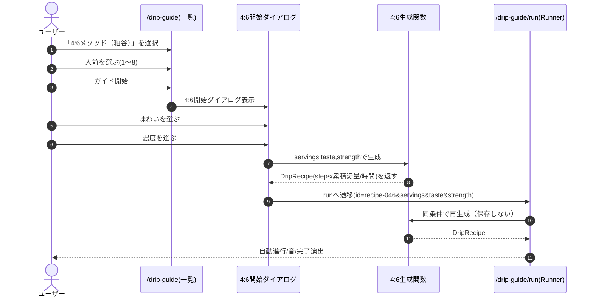

# ドリップガイド: 4:6メソッド（粕谷）要件

## 最終ユーザーストーリー（セリフ形式・確定版）

ユーザー「ドリップガイド開いた。今日は4:6で淹れたい」  
アプリ「『4:6メソッド（粕谷）』ですね。人前を選んでください（1人前=10g/150g）」  
ユーザー「2人前」  
アプリ「味わい：ベーシック／より甘く／より明るく」  
ユーザー「ベーシック」  
アプリ「濃度：薄く／より濃く／さらに濃く」  
ユーザー「さらに濃く」  
アプリ「今回の注湯プランです（時間・各投のg・累積g）。ガイド開始しますか？」  
ユーザー「開始！」  
アプリ（Runner）「次の注湯3秒前！」（カウントダウン音）  
ユーザー「迷わず注げる！」  
アプリ「完了、おつかれさまでした！」

---

## 要件（必要な機能の一覧）

### 1) 画面/導線

#### 1-1. ドリップガイド一覧（`/drip-guide`）

- デフォルトレシピとして「4:6メソッド（粕谷）」カードを追加する  
  - `isDefault: true`、削除不可  
  - 既存と同じく人前セレクト（1〜8）を持つ
- 「ガイド開始」押下で4:6専用の開始ダイアログを開く（通常レシピの注意事項ダイアログの拡張でもOK）

#### 1-2. 4:6開始ダイアログ

- 入力項目  
  - 人前（既存UI）  
  - 味わい：ベーシック / より甘く / より明るく  
  - 濃度：薄く / より濃く / さらに濃く
- 表示項目（開始前プレビュー）  
  - 自動計算された豆量(g) / 総湯量(g)  
  - 各投の注湯量(g)・累積目標(g)・開始時刻
- 操作  
  - 「ガイド開始」→ `/drip-guide/run` へ遷移

### 2) 4:6レシピ生成（保存しない）

#### 2-1. 基本スケーリング（あなたの方針）

- 1人前 = 豆10g / 湯150g  
- `beanAmountGram = 10 * servings`  
- `totalWaterGram = 150 * servings`

#### 2-2. 配分ロジック（累積目標を作る）

- `front = round(totalWaterGram * 0.4)`（味調整パート）  
- `back = totalWaterGram - front`（濃度調整パート：誤差吸収のため差分で決める）

**味（frontを2投に配分）**

- ベーシック：`front/2, front/2`  
- より甘く：`front*(5/12), front*(7/12)`（例：120g → 50g/70g）  
- より明るく：`front*(7/12), front*(5/12)`（例：120g → 70g/50g）  
- 端数は最後の投に寄せて「合計がfrontに一致」すること

**濃度（backを1/2/3投に配分）**

- 薄く：1投（`back`）  
- より濃く：2投（`back/2, back/2`）  
- さらに濃く：3投（`back/3, back/3, back/3`）  
- 端数は最後の投に寄せて「合計がbackに一致」すること

#### 2-3. ステップ（自動モード前提）

- 総投数 = 2 + (1/2/3) = 3/4/5投
- 開始時刻（秒）は固定配列から先頭N個を採用  
  - 5投：`[0, 45, 90, 135, 165]`（0:00/0:45/1:30/2:15/2:45）  
  - 4投：`[0, 45, 90, 135]`  
  - 3投：`[0, 45, 90]`
- `totalDurationSec = lastStart + 45`  
  - 5投 → 210秒（3:30）  
  - 4投 → 180秒（3:00）  
  - 3投 → 135秒（2:15）
- `DripStep.targetTotalWater` は累積値で格納（既存Runner仕様に合わせる）

**ステップの文言（例）**

- 1投目タイトル：`蒸らし（味：40%）`  
- 2投目タイトル：`2投目（味：40%）`  
- 3投目以降：`濃度調整（60%）` 等  
  - Runner上で「今どの目的の投か」が分かることが重要

### 3) /run 実行（既存Runner流用）

- 4:6は自動モード（`isManualMode:false` 相当）で実行
- 既存の1秒タイマー、ステップ自動判定、3秒前カウントダウン音、完了Lottieを流用
- 4:6専用の渡し方（推奨）  
  - `/drip-guide/run?id=recipe-046&servings=2&taste=basic&strength=strong3` のようにクエリで条件を渡す  
  - Run側で条件から同じ生成関数を呼んで `DripRecipe` を生成してRunnerに渡す  
    - URLにstepsを詰め込まない（長さ・改ざん・互換性の問題を回避）

### 4) 保存しない（一覧を増やさない）

- 生成した4:6レシピは Firestore（`AppData.dripRecipes`）に保存しない
- 任意（おすすめ）：最後に選んだ `taste/strength` をローカル保存して次回の初期値にする  
  - 一覧は増えないが「毎回同じ選択が面倒」を解消

### 5) 受け入れ条件（Acceptance Criteria）

- 一覧に「4:6メソッド（粕谷）」が表示され、削除できない  
- 人前を変えると、豆量と総湯量が `10g/150g` 基準で正しく変化する  
- 味わい×濃度を選ぶと、開始前プレビューの各投g・累積gが一貫して表示される  
- ガイド開始でRunnerが動き、時間に応じてステップが自動で進み、カウントダウン音が鳴る  
- 実行しても `AppData.dripRecipes` に新規レシピが増えない

---

## テーブル構造（テーブル形式）

※方針が「保存しない」ためDBの必須変更なし。現行の整理のみ＋任意のローカル設定。

| 収納先                 | キー      | フィールド                                                                                                 | 用途/備考                        |
| ------------------- | ------- | ----------------------------------------------------------------------------------------------------- | ---------------------------- |
| Firestore: app_data | user_id | `dripRecipes: DripRecipe[]`                                                                           | 既存のレシピ保存（デフォルト+ユーザー作成）       |
| DripRecipe（埋め込み）    | `id`    | `name, beanName, beanAmountGram, totalWaterGram, totalDurationSec, steps, isDefault, isManualMode...` | 既存の型を使用                      |
| DripStep（埋め込み）      | `id`    | `startTimeSec, title, description, targetTotalWater, note`                                            | Runnerが累積湯量を表示               |
| ローカル（任意）            | -       | `last46Taste, last46Strength`                                                                         | 4:6ダイアログの初期値（Firestoreに入れない） |

---

## シーケンス図（mermaid）

