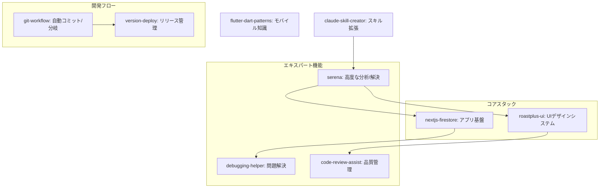

# プロジェクト・スキル図 (Skill Diagram)

この図は、プロジェクトに導入されているAIエージェントスキルの構成と、それぞれの役割・連携を示しています。

## スキル概要

| スキル名 | 役割 | 主な用途 |
| :--- | :--- | :--- |
| **serena** | 司令塔・高度分析 | 複雑な機能実装、アーキテクチャ設計 |
| **roastplus-ui** | UI/デザイン | Tailwind/Next.jsコンポーネント実装、一貫性チェック |
| **nextjs-firestore** | フロント/DB | Next.js App Router, Firebase連携の実装 |
| **debugging-helper** | 修正支援 | ランタイムエラー、ロジックミスの特定と修正 |
| **code-review-assist** | 品質向上 | PR前のコードチェック、リファクタリング提案 |
| **git-workflow** | バージョン管理 | コンベンショナルコミットに準拠したコミット |
| **version-deploy** | リリース | package.jsonの更新、デプロイ手順の実行 |
| **flutter-dart-patterns** | モバイル | 以前のFlutter資産の参照、リプレイス支援 |
| **claude-skill-creator** | 自己拡張 | 新しいスキルの作成、既存スキルのメンテナンス |

## OpenAI Codexでの利用

これらのスキルは Anthropic の Agent Skills 標準に準拠しているため、OpenAI Codex でも `.codex/skills` ディレクトリに配置することで、同様の `/命令` 形式や自動検知機能として利用可能です。
