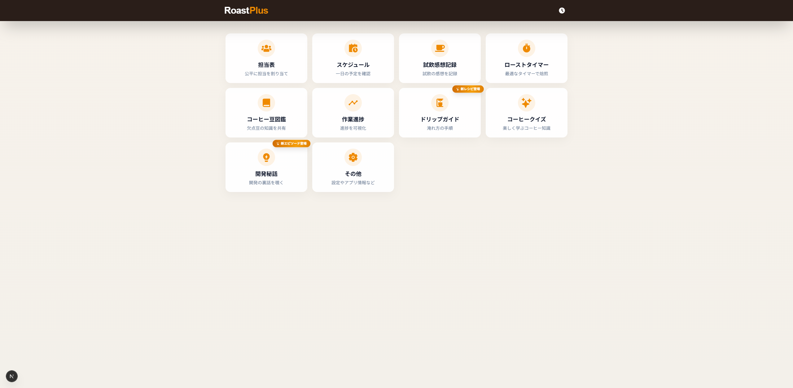
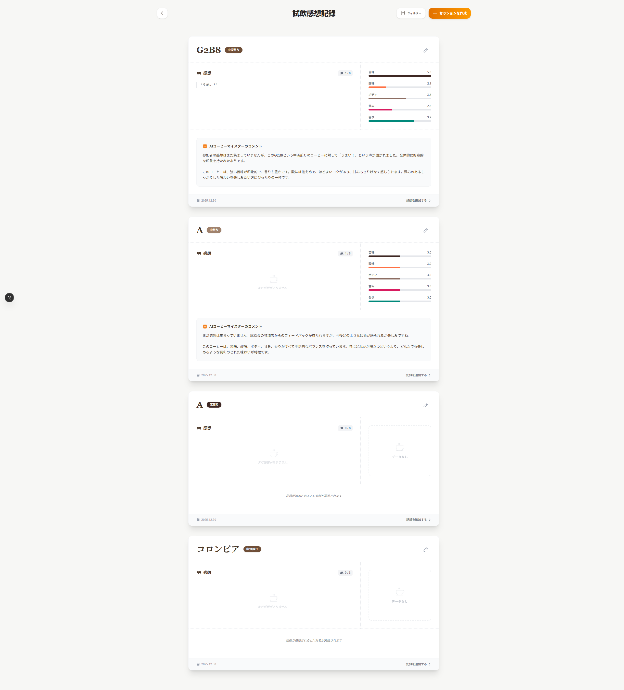
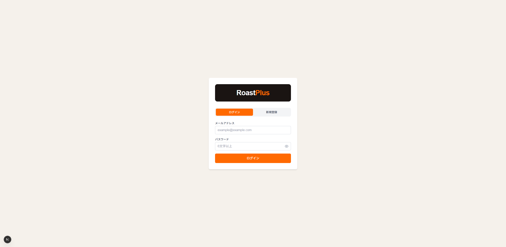
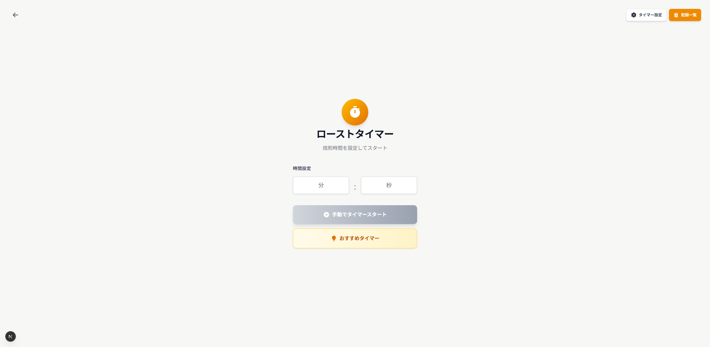
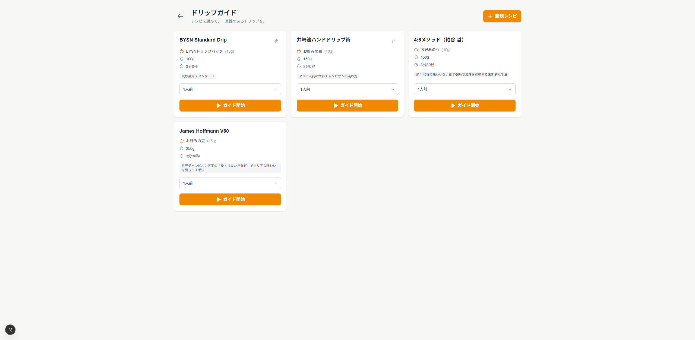
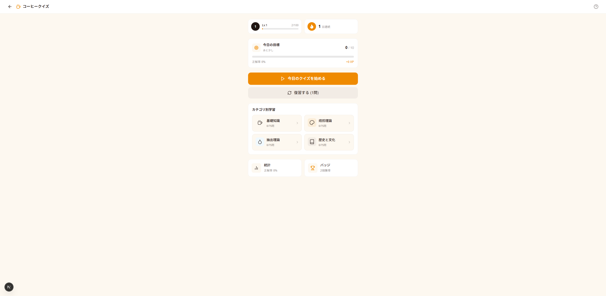
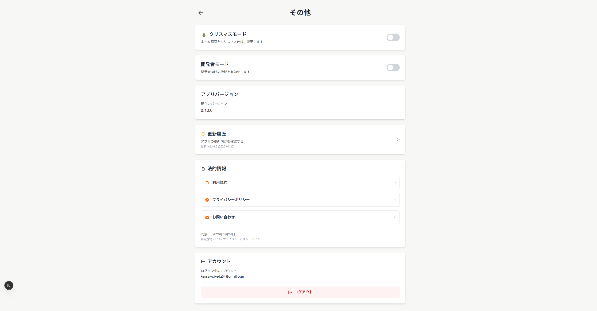
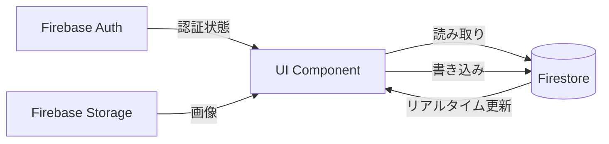

# RoastPlus - 完全版アプリケーション状態遷移図

**作成日**: 2026-01-31
**対象バージョン**: v0.10.0
**ページ数**: 全33ページ

---

## 📋 目次

1. [概要](#概要)
2. [全体構造図](#全体構造図)
3. [主要ページのスクリーンショット](#主要ページのスクリーンショット)
4. [機能別詳細遷移図](#機能別詳細遷移図)
5. [完全ページ一覧](#完全ページ一覧)
6. [技術的な実装詳細](#技術的な実装詳細)

---

## 概要

RoastPlusは、コーヒー焙煎・抽出業務を支援するNext.js PWAアプリケーションです。
本ドキュメントでは、全33ページの状態遷移関係を視覚的に表現しています。

### アプリケーションの特徴

- **認証**: Firebase Authenticationによるログイン管理
- **データ保存**: Firestore Database
- **PWA**: オフライン対応、ホーム画面追加可能
- **レスポンシブ**: スマートフォン・タブレット・デスクトップ対応

---

## 全体構造図

この図は、アプリケーション全体のページ遷移を俯瞰したものです。

```mermaid
graph TB
    %% エントリーポイント
    Start([アプリ起動]) --> CheckAuth{認証状態}

    %% 認証フロー
    CheckAuth -->|未ログイン| Login[/login<br/>ログイン画面]
    CheckAuth -->|ログイン済み| CheckConsent{同意確認}
    CheckConsent -->|同意未完了| Consent[/consent<br/>同意画面]
    CheckConsent -->|同意済み| Home[/<br/>ホーム画面]

    Login -->|認証成功| CheckConsent
    Consent -->|同意完了| Home

    %% ホームからの遷移（メインナビゲーション）
    Home --> Assignment[/assignment<br/>担当表]
    Home --> Schedule[/schedule<br/>スケジュール]
    Home --> Tasting[/tasting<br/>試飲感想記録]
    Home --> RoastTimer[/roast-timer<br/>ローストタイマー]
    Home --> DefectBeans[/defect-beans<br/>コーヒー豆図鑑]
    Home --> Progress[/progress<br/>作業進捗]
    Home --> DripGuide[/drip-guide<br/>ドリップガイド]
    Home --> CoffeeTrivia[/coffee-trivia<br/>コーヒークイズ]
    Home --> DevStories[/dev-stories<br/>開発秘話]
    Home --> Settings[/settings<br/>設定]

    %% その他のページ
    Home --> Clock[/clock<br/>時計]
    Home --> Notifications[/notifications<br/>通知]

    %% 設定からの遷移
    Settings --> SettingsFont[/settings/font<br/>フォント設定]
    Settings --> SettingsTheme[/settings/theme<br/>テーマ設定]
    Settings --> Changelog[/changelog<br/>更新履歴]
    Settings --> Contact[/contact<br/>お問い合わせ]
    Settings --> Privacy[/privacy-policy<br/>プライバシーポリシー]
    Settings --> Terms[/terms<br/>利用規約]
    Settings --> Brewing[/brewing<br/>抽出記録]
    Settings --> RoastRecord[/roast-record<br/>焙煎記録]
    Settings --> UITest[/ui-test<br/>UIテスト]
    Settings --> Tools[/tools/counter<br/>カウンター]

    %% スタイリング
    classDef authClass fill:#fef3c7,stroke:#f59e0b,stroke-width:2px
    classDef homeClass fill:#dbeafe,stroke:#3b82f6,stroke-width:3px
    classDef mainClass fill:#d1fae5,stroke:#10b981,stroke-width:2px
    classDef subClass fill:#e0e7ff,stroke:#6366f1,stroke-width:1px

    class Login,Consent authClass
    class Home homeClass
    class Assignment,Schedule,Tasting,RoastTimer,DefectBeans,Progress,DripGuide,CoffeeTrivia,DevStories,Settings mainClass
    class SettingsFont,SettingsTheme,Changelog,Contact,Privacy,Terms,Brewing,RoastRecord,UITest,Tools,Clock,Notifications subClass
```

### 凡例

- 🟡 **黄色**: 認証関連ページ
- 🔵 **青色**: ホーム画面（エントリーポイント）
- 🟢 **緑色**: メイン機能ページ（ホームから直接アクセス）
- 🟣 **紫色**: サブページ（機能内の詳細ページ）

---

## 主要ページのスクリーンショット

### 1. ホーム画面 (`/`)



**機能**:
- 10個のメイン機能へのナビゲーション
- ユーザー認証状態の確認
- クリスマスモード対応（雪のエフェクト）

**主要な遷移先**:
- 担当表、スケジュール、試飲感想記録、ローストタイマー
- コーヒー豆図鑑、作業進捗、ドリップガイド
- コーヒークイズ、開発秘話、設定

---

### 2. 試飲感想記録 (`/tasting`)



**機能**:
- テイスティングセッションの一覧表示
- 新規セッション作成
- 記録の絞り込み・フィルタリング
- レーダーチャートでの可視化

**主要な遷移先**:
- `/tasting/sessions/new` - 新規セッション作成
- `/tasting/sessions/[id]` - セッション詳細
- `/tasting/[id]` - 記録詳細

---

### 3. ログイン画面 (`/login`)



**機能**:
- Googleアカウントでのログイン
- returnUrlパラメータによるリダイレクト
- エラーハンドリング

**遷移**:
- 認証成功 → `/consent`（初回）または `returnUrl`
- キャンセル → `/`

---

### 4. ローストタイマー (`/roast-timer`)



**機能**:
- 焙煎タイマーの実行
- 温度・時間の記録
- アラーム機能
- 焙煎記録の保存

**技術的特徴**:
- Web Audio API使用
- リアルタイムグラフ表示
- PWA対応（バックグラウンド実行）

---

### 5. ドリップガイド (`/drip-guide`)



**機能**:
- ドリップレシピの管理
- ステップバイステップガイド
- タイマー機能
- カスタムレシピ作成

**主要な遷移先**:
- `/drip-guide/new` - レシピ新規作成
- `/drip-guide/edit` - レシピ編集
- `/drip-guide/run` - レシピ実行

---

### 6. コーヒークイズ (`/coffee-trivia`)



**機能**:
- カテゴリ別クイズ
- 正解率統計
- バッジシステム
- 復習モード

**主要な遷移先**:
- `/coffee-trivia/quiz` - クイズ実行
- `/coffee-trivia/category/[category]` - カテゴリ別問題
- `/coffee-trivia/badges` - バッジ一覧
- `/coffee-trivia/stats` - 統計情報

---

### 7. 設定 (`/settings`)



**機能**:
- フォント・テーマ設定
- アプリ情報
- お問い合わせ
- プライバシーポリシー・利用規約
- 開発者モード切り替え

**主要な遷移先**:
- `/settings/font` - フォント設定
- `/settings/theme` - テーマ設定
- `/changelog` - 更新履歴
- `/contact` - お問い合わせ

---

## 機能別詳細遷移図

### 1. テイスティング機能

テイスティング機能は、コーヒーの試飲記録を管理するための機能です。

```mermaid
graph TB
    Home[/<br/>ホーム] --> Tasting[/tasting<br/>試飲感想記録トップ]

    Tasting -->|新規セッション作成| NewSession[/tasting/sessions/new<br/>セッション新規作成]
    Tasting -->|セッション選択| SessionDetail[/tasting/sessions/[id]<br/>セッション詳細]
    Tasting -->|記録選択| RecordDetail[/tasting/[id]<br/>記録詳細]

    NewSession -->|作成完了| Tasting
    NewSession -->|キャンセル| Tasting

    SessionDetail -->|編集| EditSession[/tasting/sessions/[id]/edit<br/>セッション編集]
    SessionDetail -->|新規記録追加| NewRecord[/tasting/sessions/[id]/records/new<br/>記録新規作成]
    SessionDetail -->|削除| Tasting
    SessionDetail -->|戻る| Tasting

    EditSession -->|保存| SessionDetail
    EditSession -->|キャンセル| SessionDetail

    NewRecord -->|作成完了| SessionDetail
    NewRecord -->|キャンセル| SessionDetail

    RecordDetail -->|削除| Tasting
    RecordDetail -->|戻る| Tasting

    classDef tastingClass fill:#fecaca,stroke:#dc2626,stroke-width:2px
    class Tasting,NewSession,SessionDetail,EditSession,NewRecord,RecordDetail tastingClass
```

**ページ数**: 5ページ
**データモデル**:
- Session: セッション（複数の記録をグループ化）
- Record: 個別の試飲記録

---

### 2. ドリップガイド機能

ドリップコーヒーの淹れ方をガイドする機能です。

```mermaid
graph TB
    Home[/<br/>ホーム] --> DripGuide[/drip-guide<br/>レシピ一覧]

    DripGuide -->|新規レシピ作成| NewRecipe[/drip-guide/new<br/>レシピ新規作成]
    DripGuide -->|レシピ編集| EditRecipe[/drip-guide/edit<br/>レシピ編集]
    DripGuide -->|レシピ実行| RunRecipe[/drip-guide/run<br/>レシピ実行]

    NewRecipe -->|保存| DripGuide
    NewRecipe -->|キャンセル| DripGuide

    EditRecipe -->|保存| DripGuide
    EditRecipe -->|削除| DripGuide
    EditRecipe -->|キャンセル| DripGuide

    RunRecipe -->|完了| DripGuide
    RunRecipe -->|中断| DripGuide
    RunRecipe -->|戻る| DripGuide

    classDef dripClass fill:#d1fae5,stroke:#059669,stroke-width:2px
    class DripGuide,NewRecipe,EditRecipe,RunRecipe dripClass
```

**ページ数**: 4ページ
**特徴**:
- カスタムレシピ作成可能
- タイマー機能内蔵
- ステップバイステップガイド

---

### 3. コーヒークイズ機能

コーヒーに関する知識をクイズ形式で学ぶ機能です。

```mermaid
graph TB
    Home[/<br/>ホーム] --> CoffeeTrivia[/coffee-trivia<br/>クイズトップ]

    CoffeeTrivia -->|カテゴリ選択| Category[/coffee-trivia/category/[category]<br/>カテゴリ別問題一覧]
    CoffeeTrivia -->|クイズ開始| Quiz[/coffee-trivia/quiz<br/>クイズ実行]
    CoffeeTrivia -->|復習| Review[/coffee-trivia/review<br/>復習モード]
    CoffeeTrivia -->|統計| Stats[/coffee-trivia/stats<br/>統計情報]
    CoffeeTrivia -->|バッジ| Badges[/coffee-trivia/badges<br/>バッジ一覧]

    Category -->|順次モード| Quiz
    Category -->|シャッフルモード| Quiz
    Category -->|カテゴリ別モード| Quiz
    Category -->|戻る| CoffeeTrivia

    Quiz -->|完了| CoffeeTrivia
    Quiz -->|完了| Category

    Review -->|戻る| CoffeeTrivia
    Stats -->|戻る| CoffeeTrivia
    Badges -->|戻る| CoffeeTrivia

    classDef quizClass fill:#fef3c7,stroke:#f59e0b,stroke-width:2px
    class CoffeeTrivia,Category,Quiz,Review,Stats,Badges quizClass
```

**ページ数**: 6ページ
**カテゴリ**:
- 産地（origin）
- 品種（variety）
- 精製方法（processing）
- 焙煎（roasting）
- 抽出（brewing）
- 欠点豆（defects）

---

### 4. 開発秘話機能

アプリの開発過程を紹介する機能です。

```mermaid
graph TB
    Home[/<br/>ホーム] --> DevStories[/dev-stories<br/>エピソード一覧]

    DevStories -->|エピソード選択| Episode[/dev-stories/[id]<br/>エピソード詳細]

    Episode -->|前のエピソード| PrevEpisode[/dev-stories/[prevId]<br/>前のエピソード]
    Episode -->|次のエピソード| NextEpisode[/dev-stories/[nextId]<br/>次のエピソード]
    Episode -->|戻る| DevStories

    PrevEpisode -.->|ナビゲーション| Episode
    NextEpisode -.->|ナビゲーション| Episode

    classDef storiesClass fill:#e0e7ff,stroke:#6366f1,stroke-width:2px
    class DevStories,Episode,PrevEpisode,NextEpisode storiesClass
```

**ページ数**: 2ページ
**コンテンツ**:
- Markdownで記述
- 画像埋め込み対応
- 前後のエピソードへのナビゲーション

---

### 5. ローストタイマー機能

焙煎プロセスをタイマーで管理する機能です。

```mermaid
graph TB
    Home[/<br/>ホーム] --> RoastTimer[/roast-timer<br/>タイマートップ]

    RoastTimer -->|タイマー開始| TimerRunning[タイマー実行中]
    RoastTimer -->|設定| TimerSettings[設定モーダル]
    RoastTimer -->|記録保存| SaveRecord[記録保存]

    TimerRunning -->|完了| RoastTimer
    TimerRunning -->|リセット| RoastTimer

    TimerSettings -->|保存| RoastTimer
    TimerSettings -->|キャンセル| RoastTimer

    SaveRecord -->|保存完了| RoastTimer

    RoastTimer -->|戻る| Home

    classDef timerClass fill:#fed7aa,stroke:#ea580c,stroke-width:2px
    class RoastTimer,TimerRunning,TimerSettings,SaveRecord timerClass
```

**ページ数**: 1ページ（モーダル含む）
**技術的特徴**:
- Web Audio APIでアラーム
- リアルタイムグラフ描画
- PWA対応（バックグラウンド実行）

---

### 6. 設定・その他機能

アプリの設定とその他の補助機能です。

```mermaid
graph TB
    Home[/<br/>ホーム] --> Settings[/settings<br/>設定トップ]

    Settings -->|フォント設定| Font[/settings/font<br/>フォント設定]
    Settings -->|テーマ設定| Theme[/settings/theme<br/>テーマ設定]
    Settings -->|更新履歴| Changelog[/changelog<br/>更新履歴]
    Settings -->|お問い合わせ| Contact[/contact<br/>お問い合わせ]
    Settings -->|プライバシー| Privacy[/privacy-policy<br/>プライバシーポリシー]
    Settings -->|利用規約| Terms[/terms<br/>利用規約]
    Settings -->|抽出記録| Brewing[/brewing<br/>抽出記録]
    Settings -->|焙煎記録| RoastRecord[/roast-record<br/>焙煎記録]

    Font -->|戻る| Settings
    Theme -->|戻る| Settings
    Changelog -->|戻る| Settings
    Contact -->|戻る| Settings
    Privacy -->|戻る| Settings
    Terms -->|戻る| Settings
    Brewing -->|戻る| Settings
    RoastRecord -->|戻る| Settings

    classDef settingsClass fill:#e5e7eb,stroke:#6b7280,stroke-width:2px
    class Settings,Font,Theme,Changelog,Contact,Privacy,Terms,Brewing,RoastRecord settingsClass
```

**ページ数**: 10ページ
**設定項目**:
- フォント（Zen Old Mincho, Inter, Roboto Mono等）
- テーマ（ライト/ダーク/クリスマス）
- 開発者モード切り替え

---

## 完全ページ一覧

### 認証関連（2ページ）
| パス | 名称 | 説明 | 遷移元 |
|------|------|------|--------|
| `/login` | ログイン画面 | Googleアカウント認証 | 全ページ（未認証時） |
| `/consent` | 同意画面 | プライバシーポリシー・利用規約への同意 | `/login`（初回ログイン時） |

### メインページ（1ページ）
| パス | 名称 | 説明 | 遷移元 |
|------|------|------|--------|
| `/` | ホーム画面 | 全機能へのナビゲーションハブ | `/login`, `/consent`（認証後） |

### 主要機能（10ページ）
| パス | 名称 | 説明 | 遷移元 |
|------|------|------|--------|
| `/assignment` | 担当表 | 公平な担当割り当て | `/` |
| `/schedule` | スケジュール | 一日の予定確認 | `/` |
| `/tasting` | 試飲感想記録 | 試飲記録の管理 | `/` |
| `/roast-timer` | ローストタイマー | 焙煎タイマー | `/` |
| `/defect-beans` | コーヒー豆図鑑 | 欠点豆の知識共有 | `/` |
| `/progress` | 作業進捗 | 進捗の可視化 | `/` |
| `/drip-guide` | ドリップガイド | 淹れ方の手順 | `/` |
| `/coffee-trivia` | コーヒークイズ | クイズで学ぶ | `/` |
| `/dev-stories` | 開発秘話 | 開発の裏話 | `/` |
| `/settings` | 設定 | 各種設定 | `/` |

### テイスティング関連（5ページ）
| パス | 名称 | 説明 | 遷移元 |
|------|------|------|--------|
| `/tasting/sessions/new` | セッション新規作成 | 新しいセッションを作成 | `/tasting` |
| `/tasting/sessions/[id]` | セッション詳細 | セッション情報と記録一覧 | `/tasting` |
| `/tasting/sessions/[id]/edit` | セッション編集 | セッション情報を編集 | `/tasting/sessions/[id]` |
| `/tasting/sessions/[id]/records/new` | 記録新規作成 | セッションに記録を追加 | `/tasting/sessions/[id]` |
| `/tasting/[id]` | 記録詳細 | 個別記録の詳細 | `/tasting` |

### ドリップガイド関連（3ページ）
| パス | 名称 | 説明 | 遷移元 |
|------|------|------|--------|
| `/drip-guide/new` | レシピ新規作成 | 新しいレシピを作成 | `/drip-guide` |
| `/drip-guide/edit` | レシピ編集 | 既存レシピを編集 | `/drip-guide` |
| `/drip-guide/run` | レシピ実行 | レシピに従って抽出 | `/drip-guide` |

### コーヒークイズ関連（5ページ）
| パス | 名称 | 説明 | 遷移元 |
|------|------|------|--------|
| `/coffee-trivia/quiz` | クイズ実行 | クイズを解く | `/coffee-trivia`, `/coffee-trivia/category/[category]` |
| `/coffee-trivia/category/[category]` | カテゴリ別問題一覧 | カテゴリ別の問題表示 | `/coffee-trivia` |
| `/coffee-trivia/review` | 復習モード | 間違えた問題を復習 | `/coffee-trivia` |
| `/coffee-trivia/stats` | 統計情報 | 正解率などの統計 | `/coffee-trivia` |
| `/coffee-trivia/badges` | バッジ一覧 | 獲得バッジの表示 | `/coffee-trivia` |

### 開発秘話関連（1ページ）
| パス | 名称 | 説明 | 遷移元 |
|------|------|------|--------|
| `/dev-stories/[id]` | エピソード詳細 | 特定エピソードの表示 | `/dev-stories` |

### 設定関連（10ページ）
| パス | 名称 | 説明 | 遷移元 |
|------|------|------|--------|
| `/settings/font` | フォント設定 | フォント選択 | `/settings` |
| `/settings/theme` | テーマ設定 | テーマ選択 | `/settings` |
| `/changelog` | 更新履歴 | バージョン履歴 | `/settings` |
| `/contact` | お問い合わせ | お問い合わせフォーム | `/settings` |
| `/privacy-policy` | プライバシーポリシー | プライバシーポリシー | `/settings`, `/consent` |
| `/terms` | 利用規約 | 利用規約 | `/settings`, `/consent` |
| `/brewing` | 抽出記録 | 抽出記録の管理 | `/settings` |
| `/roast-record` | 焙煎記録 | 焙煎記録の管理 | `/settings` |
| `/ui-test` | UIテスト | 開発者向けテスト画面 | `/settings`（開発者モード） |
| `/tools/counter` | カウンター | シンプルなカウンター | `/settings` |

### その他（2ページ）
| パス | 名称 | 説明 | 遷移元 |
|------|------|------|--------|
| `/clock` | 時計 | 大きな時計表示 | `/` |
| `/notifications` | 通知 | 通知一覧 | `/` |

**合計**: 33ページ

---

## 技術的な実装詳細

### ナビゲーション方式

#### 1. Link コンポーネント (next/link)

静的なナビゲーションに使用。

```typescript
import Link from 'next/link';

<Link href="/tasting" className="...">
  試飲感想記録
</Link>
```

**使用箇所**:
- ホームページのACTIONS配列
- 各ページの「戻る」リンク
- カード型ナビゲーション

#### 2. router.push() (useRouter)

動的・条件付きナビゲーションに使用。

```typescript
import { useRouter } from 'next/navigation';

const router = useRouter();

// 認証後のリダイレクト
router.push('/login');

// パラメータ付き遷移
router.push(`/tasting?sessionId=${sessionId}`);

// 条件付きリダイレクト
if (!user) {
  router.push('/login?returnUrl=/tasting');
}
```

**使用箇所**:
- 認証ガード
- データ操作後のリダイレクト
- エラー時の遷移

#### 3. router.back()

ブラウザの戻る操作。

```typescript
router.back();
```

**使用箇所**:
- モーダルの「キャンセル」ボタン
- エラー時の「戻る」ボタン

### 認証フロー

すべてのページは以下の認証チェックを経由します。

```typescript
// app/page.tsx（例）
const { user, loading } = useAuth();

useEffect(() => {
  if (!loading && !user) {
    router.push('/login');
  }
}, [user, loading, router]);

// 同意状態のチェック
useEffect(() => {
  async function checkUserConsent() {
    if (!user) return;

    const userData = await getUserData(user.uid);
    if (needsConsent(userData.userConsent)) {
      router.push('/consent');
      return;
    }
  }

  if (!loading && user) {
    checkUserConsent();
  }
}, [user, loading, router]);
```

**フロー**:
1. `useAuth()` で認証状態をチェック
2. 未ログイン → `/login` へリダイレクト
3. ログイン済み → 同意状態をチェック
4. 同意未完了 → `/consent` へリダイレクト
5. 同意済み → ページ表示

### クエリパラメータ

URLクエリパラメータで状態を管理。

| パラメータ | 用途 | 例 |
|-----------|------|-----|
| `returnUrl` | ログイン後のリダイレクト先 | `/login?returnUrl=/tasting` |
| `recordId` | 特定の記録を開く | `/tasting?recordId=abc123` |
| `sessionId` | 特定のセッションを開く | `/tasting?sessionId=xyz789` |
| `edit` | 編集モードで開く | `/tasting?sessionId=xyz789&edit=true` |
| `mode` | クイズのモード | `/coffee-trivia/quiz?mode=sequential` |
| `category` | カテゴリ指定 | `/coffee-trivia/quiz?category=origin` |
| `questionIds` | 問題ID配列 | `/coffee-trivia/quiz?questionIds=1,2,3` |

### データフロー



**使用技術**:
- **Firebase Auth**: ユーザー認証
- **Firestore**: データベース
- **Firebase Storage**: 画像ストレージ
- **PWA**: Service Worker、キャッシュ

### ページ遷移のベストプラクティス

1. **認証ガードの一貫性**
   - すべてのページで `useAuth()` を使用
   - `loading` 状態を適切にハンドリング

2. **戻る操作の統一**
   - 詳細ページ → トップページ → ホーム
   - モーダルは `router.back()` でキャンセル

3. **エラーハンドリング**
   - データ取得エラー → トーストで通知 → 前のページへ
   - 認証エラー → `/login` へリダイレクト

4. **ローディング状態**
   - データ取得中は `<Loading />` コンポーネント表示
   - スプラッシュスクリーン（3秒間）

---

## まとめ

RoastPlusは、33ページからなる包括的なコーヒー業務支援アプリケーションです。

### アプリケーションの特徴

✅ **認証**: Firebase Authenticationによる安全なログイン
✅ **PWA**: オフライン対応、ホーム画面追加可能
✅ **レスポンシブ**: スマホ・タブレット・デスクトップ対応
✅ **リアルタイム**: Firestoreによるデータ同期
✅ **ユーザーフレンドリー**: 直感的なUI/UX

### 主要機能

| 機能 | ページ数 | 主な用途 |
|------|----------|----------|
| 試飲感想記録 | 5 | テイスティング記録の管理 |
| ドリップガイド | 4 | 抽出手順のガイド |
| コーヒークイズ | 6 | 知識の学習・復習 |
| ローストタイマー | 1 | 焙煎プロセスの管理 |
| その他 | 17 | 設定、情報、補助機能 |

### 今後の拡張性

- 新機能の追加が容易な設計
- モジュール化されたコンポーネント
- 統一された遷移パターン

---

**生成日時**: 2026-01-31
**ツール**: Claude Code + Chrome DevTools MCP
**スクリーンショット**: 7枚（主要ページ）

