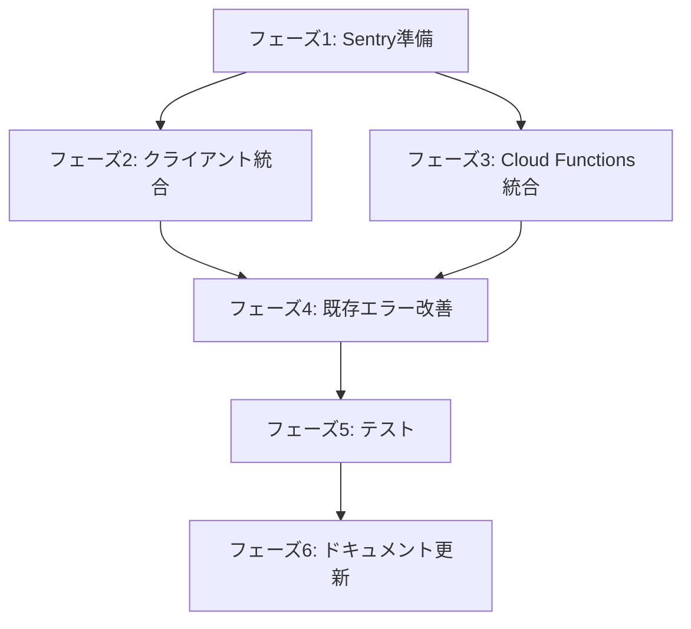

# タスクリスト

**Issue**: #213
**作成日**: 2026-02-11

---

## フェーズ1: Sentry準備・設定（30分）

### 1.1 Sentryアカウント・プロジェクト作成
- [ ] Sentry.io でアカウント作成（無料プラン）
- [ ] プロジェクト作成（`roastplus`）
- [ ] DSNを取得

**成果物**: Sentry DSN

---

### 1.2 環境変数設定
- [ ] `.env.local` に追加:
  - `NEXT_PUBLIC_SENTRY_DSN`
  - `NEXT_PUBLIC_SENTRY_ENVIRONMENT=development`
  - `NEXT_PUBLIC_APP_VERSION=0.11.0`
- [ ] `.env.production` に追加（同上、`ENVIRONMENT=production`）
- [ ] `.gitignore` で `.env.local`, `.env.production` を確認

**成果物**: 環境変数ファイル

---

### 1.3 依存関係インストール（クライアント）
- [ ] `npm install --save @sentry/nextjs@^8`
- [ ] `package.json` の `dependencies` を確認

**成果物**: `package.json` 更新

---

### 1.4 依存関係インストール（Cloud Functions）
- [ ] `cd functions && npm install --save @sentry/node@^8 @sentry/profiling-node@^8`
- [ ] `functions/package.json` の `dependencies` を確認

**成果物**: `functions/package.json` 更新

---

### 1.5 Firebase Functions Secrets設定
- [ ] `firebase functions:secrets:set SENTRY_DSN` （Sentry DSNを入力）
- [ ] `firebase functions:secrets:set SENTRY_ENVIRONMENT` （`production` を入力）

**成果物**: Firebase Functions Secrets

---

## フェーズ2: クライアント側Sentry統合（1時間）

### 2.1 Sentry初期化ファイル作成
- [ ] `sentry.client.config.ts` を作成（`design.md` の実装例参照）
- [ ] `app/layout.tsx` で `import '@/sentry.client.config'` を追加（最上部）

**成果物**: `sentry.client.config.ts`, `app/layout.tsx` 更新

---

### 2.2 ErrorBoundary作成（グローバル）
- [ ] `app/global-error.tsx` を作成（`design.md` の実装例参照）
- [ ] 意図的にエラーをスローしてテスト（開発環境）

**成果物**: `app/global-error.tsx`

---

### 2.3 ErrorBoundary作成（ページレベル）
- [ ] `app/error.tsx` を作成（`design.md` の実装例参照）
- [ ] 共通UIコンポーネント（`Button`）を使用
- [ ] CSS変数（`bg-page`, `bg-overlay`, `text-ink`）を使用

**成果物**: `app/error.tsx`

---

### 2.4 Sentryヘルパー関数作成
- [ ] `lib/sentry.ts` を作成（`captureError`, `captureMessage`）
- [ ] 開発環境ではコンソールログのみ、本番環境ではSentry送信

**成果物**: `lib/sentry.ts`

---

### 2.5 動作確認（クライアント）
- [ ] 開発環境で意図的にエラーをスロー → コンソールにログ表示
- [ ] 本番ビルド → Sentryダッシュボードでエラー確認

**成果物**: Sentry動作確認

---

## フェーズ3: Cloud Functions側Sentry統合（30分）

### 3.1 Sentry初期化ヘルパー作成
- [ ] `functions/src/sentry.ts` を作成（`initSentry`, `captureError`）

**成果物**: `functions/src/sentry.ts`

---

### 3.2 OCR関数にSentry統合
- [ ] `functions/src/ocr-schedule.ts` を修正:
  - `secrets` に `SENTRY_DSN`, `SENTRY_ENVIRONMENT` 追加
  - `initSentry()` を関数開始時に呼び出し
  - `catch` ブロックで `captureError()` 呼び出し

**成果物**: `functions/src/ocr-schedule.ts` 更新

---

### 3.3 テイスティング分析関数にSentry統合
- [ ] `functions/src/tasting-analysis.ts` を修正（上記と同様）

**成果物**: `functions/src/tasting-analysis.ts` 更新

---

### 3.4 動作確認（Cloud Functions）
- [ ] Firebase Functionsデプロイ: `firebase deploy --only functions`
- [ ] OCR機能を実行 → Sentryダッシュボードでエラー確認

**成果物**: Cloud Functions Sentry動作確認

---

## フェーズ4: 既存エラーハンドリング改善（1.5時間）

### 4.1 重要度高（優先）
- [ ] `lib/auth.ts` (2箇所) → `captureError` 追加
- [ ] `lib/scheduleOCR.ts` (2箇所) → `captureError` 追加
- [ ] `lib/tastingAnalysis.ts` (1箇所) → `captureError` 追加
- [ ] `lib/storage.ts` (2箇所) → `captureError` 追加
- [ ] `lib/firestore/userData/crud.ts` (2箇所) → `captureError` 追加
- [ ] `lib/firestore/userData/write-queue.ts` (1箇所) → `captureError` 追加
- [ ] `lib/firestore/defectBeans.ts` (3箇所) → `captureError` 追加

**パターン**:
```typescript
import { captureError } from '@/lib/sentry';

try {
  // 既存処理
} catch (error) {
  captureError(error, { tags: { context: 'auth' } });
  console.error('エラー:', error); // 既存ログは残す
}
```

**成果物**: 重要度高のファイル7件更新

---

### 4.2 重要度中（オプショナル）
- [ ] `lib/localStorage.ts` (1箇所)
- [ ] `lib/notifications.ts` (4箇所)
- [ ] `lib/sounds.ts` (13箇所)
- [ ] `lib/emailjs.ts` (1箇所)

**タイミング**: 時間があれば実施

**成果物**: 重要度中のファイル4件更新

---

### 4.3 重要度低（スキップ）
- スキップ（後続のIssueで対応）

---

## フェーズ5: テスト・検証（30分）

### 5.1 ビルド確認
- [ ] `npm run lint` → エラーなし
- [ ] `npm run build` → 成功
- [ ] `cd functions && npm run build` → 成功

**成果物**: ビルド成功確認

---

### 5.2 手動テスト（クライアント）
- [ ] 意図的にエラーをスロー → `app/error.tsx` が表示される
- [ ] Sentryダッシュボードでエラー確認
- [ ] エラーに `userId`, `tags`, `extra` が含まれる

**成果物**: 手動テスト結果

---

### 5.3 手動テスト（Cloud Functions）
- [ ] OCR機能を実行（エラーケース）→ Sentryダッシュボードで確認
- [ ] テイスティング分析を実行（エラーケース）→ Sentryダッシュボードで確認

**成果物**: 手動テスト結果

---

## フェーズ6: ドキュメント更新（30分）

### 6.1 Steering Documents更新
- [ ] `docs/steering/TECH_SPEC.md` に以下を追加:
  - **エラー監視**: Sentry（クライアント・Cloud Functions）
  - **導入理由**: 本番環境のエラー追跡、再現困難なバグの特定
- [ ] `docs/steering/GUIDELINES.md` に以下を追加:
  - **エラーハンドリングパターン**: `captureError` の使い方
  - **開発環境**: コンソールログのみ
  - **本番環境**: Sentry送信

**成果物**: `TECH_SPEC.md`, `GUIDELINES.md` 更新

---

## 依存関係



- フェーズ1が完了しないと、フェーズ2・3は開始できない
- フェーズ2・3は並行実施可能
- フェーズ4はフェーズ2・3完了後に開始

---

## 見積もり

| フェーズ | 見積もり | 備考 |
|---------|---------|------|
| フェーズ1 | 30分 | Sentryアカウント作成・設定 |
| フェーズ2 | 1時間 | クライアント側統合 |
| フェーズ3 | 30分 | Cloud Functions統合 |
| フェーズ4 | 1.5時間 | 重要度高のみ（7ファイル） |
| フェーズ5 | 30分 | テスト |
| フェーズ6 | 30分 | ドキュメント更新 |
| **合計** | **約4.5時間** | AIエージェント実行時間 |

**注**: ユーザーが手動で実装する場合は、見積もり×3〜4倍（12〜18時間）を想定。

---

## チェックポイント

### ✅ フェーズ1完了後
- [ ] Sentry DSNが取得できている
- [ ] 環境変数が設定されている

### ✅ フェーズ2完了後
- [ ] クライアントでエラーが発生した際、Sentryダッシュボードで確認できる

### ✅ フェーズ3完了後
- [ ] Cloud Functionsでエラーが発生した際、Sentryダッシュボードで確認できる

### ✅ フェーズ5完了後
- [ ] `npm run build` が成功
- [ ] 手動テストで意図的なエラーがSentryに送信される

### ✅ フェーズ6完了後
- [ ] Steering Documentsが更新されている
